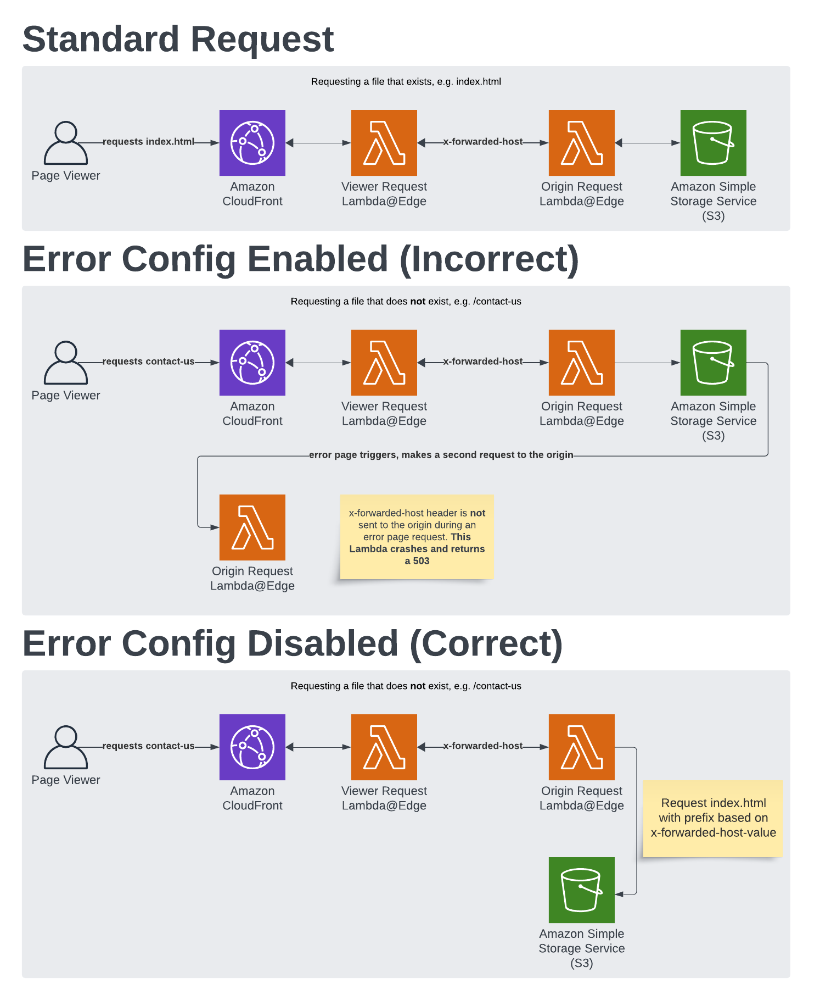

# Feature Environment Lambda@Edge Handlers

A collection of Lambda@Edge functions to handle routing in feature environments. 

Feature environments are temporary environments that are created on a pull request. They function almost the same as regular statically hosted environments, however, there are multiple frontends hosted in the same bucket. Therefore, we require a method to route to the correct sub-path depending on which subdomain the user has visited. 

# Common issues

Error config must be **disabled** for these functions to work. See the below diagram for the reasoning. 

