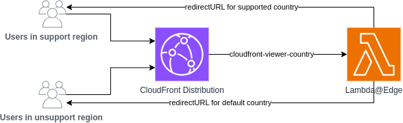

# Geo-IP Redirect 

  

## Overview

This library provides a construct which creates a Lambda@Edge function to perform GeoIP redirects. The Aligent Esbuild CDK construct is used to bundle the handler function from `handler/redirect.ts`.

These functions are intended to be added to an existing Cloudfront distribution. When the Lambda@Edge function is triggered, the function is passed the CloudFrontRequestEvent.

The Lambda@Edge function will check if the viewer's country code matches any supported regions. The country code from each request is pulled from the `cloudfront-viewer-country` header:
- if they match, they are redirected to `${redirectURL}${countryCode.toLowerCase()}${request.uri}`
- if they do not match, they are redirected to `${redirectURL}${DEFAULT_REGION.toLowerCase()}${request.uri}`

The `DEFAULT_REGION` is set as an option in the Lambda@Edge handler code

## Diagram



## Usage and Default Geo-IP Redirect options
### `redirectHost` (string)
- Base hostname used for redirects

### `supportedRegionsExpression` (string)
- Case-sensitive regular expression matching cloudfront-viewer-country

### `defaultRegion` (string)
- Fallback region code when viewer's country does not match the supported pattern

## Example code
When defining the Lambda@Edge function, this construct serves one default host to redirect too:
```
define: {
                "process.env.REDIRECT_HOST": options.redirectHost,
                "process.env.SUPPORTED_REGIONS":
                  options.supportedRegionsExpression,
                "process.env.DEFAULT_REGION": options.defaultRegion,
              },
```