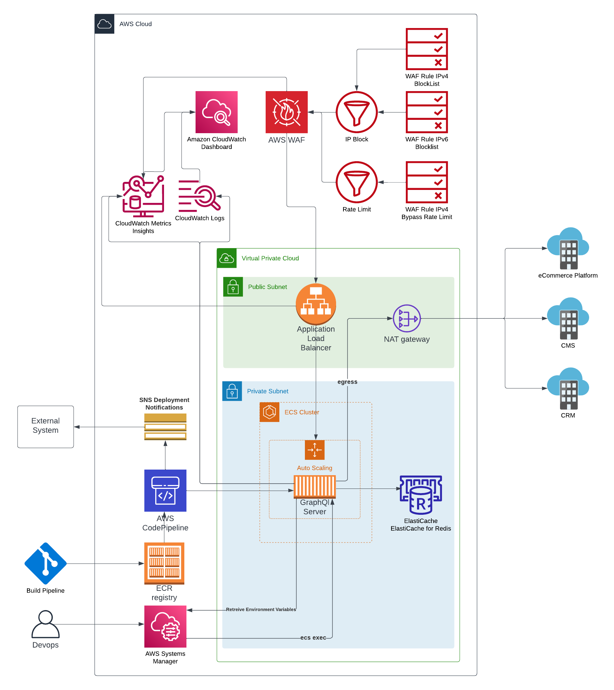

# GraphQL Mesh in Fargate
A construct to host a [GraphQL Mesh](https://the-guild.dev/graphql/mesh) server in Fargate. 

## Deployment notifications
If notificationArn is set this construct creates a CodeStar notification rule, SNS topic and Lambda function to receive notifications for codepipeline executions and forward them to another SNS topic. This is so that you can setup AWS Chatbot either in this account OR another account and forward the notifications there. 
