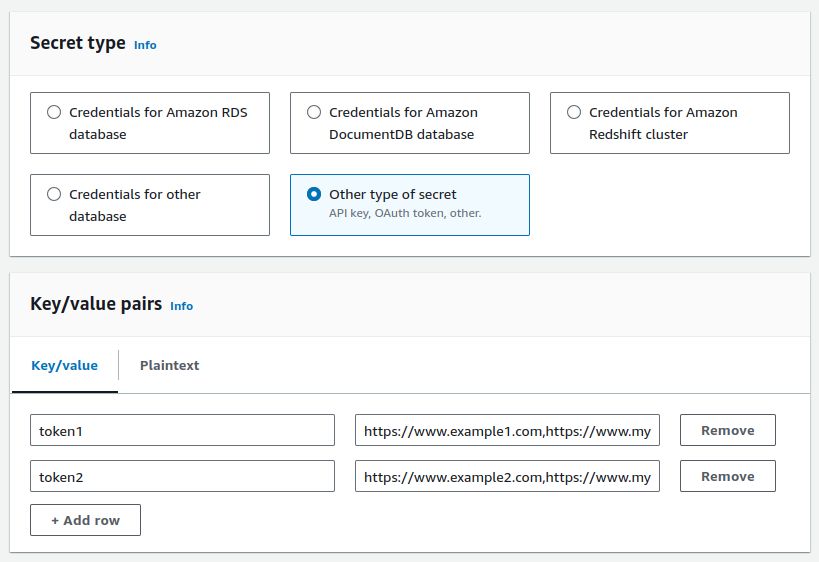

# PrerenderFargate Construct

The PrerenderFargate construct sets up an AWS Fargate service to run a [Prerender] service in an ECS Fargate cluster.

The Prerender server listens for an HTTP request, takes the URL, and loads it in Headless Chrome, waits for the page to finish loading, and then returns your content to the requesting client.

## AWS Resources Created/Configured by this Construct

- **S3 Bucket:** For storing pre-rendered web pages.
- **ECS Fargate Service:** For running the Prerender service.
- **ECR Asset:** For managing the Docker image of the Prerender service.
- **VPC & VPC Endpoints:** For network configuration and enabling direct access to S3.
- **Recache API:** (optional) To trigger recaching of URLs.

## AWS Resource that needs to be pre-configured

- **SecretsManager Secret:** For Prerender and Recaching service authentication.

## Usage and PrerenderFargateOptions

To use the PrerenderFargate construct, you can instantiate it with suitable PrerenderFargateOptions and place it within a CDK stack. The PrerenderOptions parameter allows the developer to customize various aspects of the Prerender service.

### `prerenderName` (string)

- The name of the Prerender service.

### `domainName` (string)

- The domain name to Prerender service.

### `tokenSecret` (strings)

- A pre-configured AWS SecretsManager Secret name with the value being in the format of `Map<String: String[]>`, for example, `{"token1": "https://www.example1.com,https://www.mydomain1.com", "token2":"https://www.example2.com,https://www.mydomain2.com"}`. This map is referenced for Prerender and Recaching service authentication.



### `vpcId` (string, optional)

- The ID of the VPC to deploy the Fargate service in. Default: environment-default VPC.

### `bucketName` (string, optional)

- The name of the S3 bucket to store pre-rendered cache pages in. Default: randomly generated bucket name.

### `expirationDays` (number, optional)

- The number of days to keep pre-rendered cache pages in the S3 bucket before expiring them. Default: 7 days.

### `certificateArn` (string)

- The ARN of the SSL certificate to use for HTTPS connections to the Prerender service.

### `desiredInstanceCount` (number, optional)

- The desired number of Fargate instances to run. Default: 1

### `maxInstanceCount` (number, optional)

- The maximum number of Fargate instances to run. Default: 2

### `minInstanceCount` (number, optional)

- The minimum number of Fargate instances to run. Default: 1

### `instanceCPU` (number, optional)

- The amount of CPU to allocate to each Fargate instance, with 1024 being 1 vCPU. Default: 512, i.e. 0.5 vCPU

### `instanceMemory` (number, optional)

- The amount of memory to allocate to each Fargate instance. Default: 1024, i.e. 1GB

### `enableRedirectCache` (boolean, optional)

- Whether to enable caching of HTTP redirects. Default: false

### `enableS3Endpoint` (boolean, optional)

- Whether to enable the [VPC endpoint](https://docs.aws.amazon.com/vpc/latest/privatelink/create-interface-endpoint.html) for S3. Default: false

### `prerenderFargateScalingOptions` (PrerenderFargateScalingOptions, optional)

- This allows to alter the scaling behaviour. The default configuration should be sufficient for most of the cases.

### `prerenderFargateRecachingOptions` (PrerenderFargateRecachingOptions, optional)

- This allows to alter the re-caching behaviour. The default configuration should be sufficient.

### `enableRecache` (boolean, optional)

- Create Recache API service. Default: true

### `tokenList` (Array of strings, deprecated)

- A list of tokens to use for authentication with the Prerender service. (This parameter is deprecated and removed as of 2.3.0. Please use the `tokenSecret` parameter instead.)

### `tokenUrlAssociation` (PrerenderTokenUrlAssociationOptions, deprecated)

- Configuration for associating tokens with specific domain URLs. During the recaching process, these tokens will be used to validate the request. (This parameter is deprecated and removed as of 2.3.0. Please use the `tokenSecret` parameter instead.)

## Example

Here's an example of how to use the PrerenderFargate construct in a TypeScript CDK application:

```typescript
import { Stack, StackProps } from "aws-cdk-lib";
import { Construct } from "constructs";
import {
  PrerenderFargate,
  PrerenderFargateOptions,
} from "@aligent/cdk-prerender-fargate";

export class RagPrerenderStackStack extends Stack {
  constructor(scope: Construct, id: string, props: StackProps) {
    super(scope, id, props);

    new PrerenderFargate(this, "PrerenderService", {
      prerenderName: "myPrerender",
      domainName: "prerender.mydomain.com",
      vpcId: "vpc-xxxxxxxx",
      bucketName: "myPrerenderBucket",
      expirationDays: 7,
      certificateArn:
        "arn:aws:acm:region:account:certificate/xxxxxxxx-xxxx-xxxx-xxxx-xxxxxxxxxxxx",
      tokenSecret: "/prerender/tokens",
      minInstanceCount: 1,
      desiredInstanceCount: 1,
      maxInstanceCount: 2,
      instanceCPU: 512,
      instanceMemory: 1024,
      enableRedirectCache: false,
      enableS3Endpoint: false,
      prerenderFargateRecachingOptions: {
        maxConcurrentExecutions: 1,
      },
      prerenderFargateScalingOptions: {
        healthCheckGracePeriod: 20,
        healthCheckInterval: 30,
        unhealthyThresholdCount: 3,
        scaleInCooldown: 120,
        scaleOutCooldown: 60,
      },
      enableRecache: true,
    });
  }
}
```

# Local Development

Prerender can be run locally with docker:

```bash

docker build lib/prerender --tag prerender:1
docker run -p 3000:3000 -e TOKEN_SECRET='{"token1": "https://www.emaplesite.com.au"}' -e ENABLE_REDIRECT_CACHE='true' -e ENABLE_PRERENDER_HEADER='true' prerender:1


curl http://localhost:3000/https://www.emaplesite.com.au/home -H 'x-prerender-token: token1'
```

## Acknowledgements

- [prerender.io](https://prerender.io/) - The Prerender service.

[Prerender]: https://github.com/prerender/prerender
