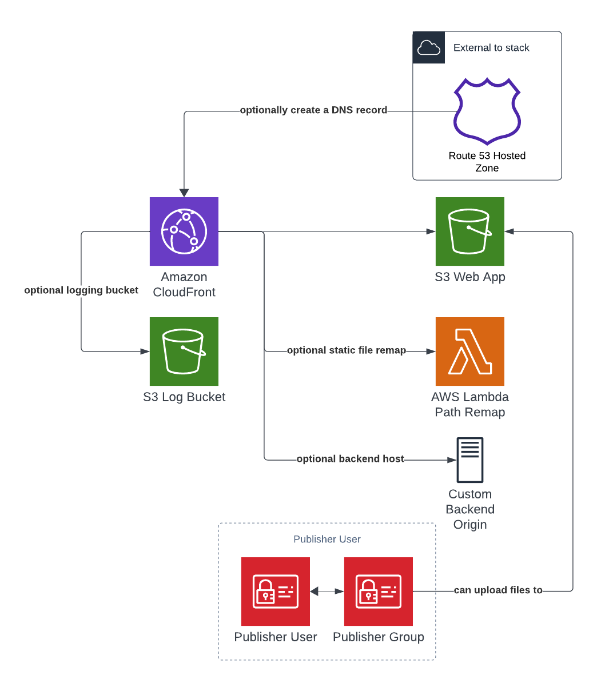

# Aligent AWS Static Hosting

## Overview

This repository defines a CDK construct for hosting a static website on AWS using S3 and CloudFront.

It can be imported and used within CDK applications. By default this construct will create a CloudFront distribution with an S3 bucket as the origin. It will also create an IAM user and group that have permission to create files in the S3 bucket.

It has the following features that can optionally be enabled:

- Create a DNS record in an existing hosted zone
- Store CloudFront logs in an S3 bucket
- Add a custom backend origin
- Remap static files to the the S3 or backend origin



## Example

The following CDK snippet can be used to provision a static hosting stack using this construct.

```
import 'source-map-support/register';
import * as cdk from '@aws-cdk/core';
import { StaticHosting, StaticHostingProps } from '@aligent/cdk-static-hosting'
import { Construct, Stack, StackProps } from '@aws-cdk/core';


const HostingStackProps : StaticHostingProps = {
    subDomainName: 'sub.domain',
    domainName: 'domain.tld',
    certificateArn: 'arn:aws:acm:us-east-1:123456789:certificate/some-arn-id',
    createDnsRecord: false,
    enableErrorConfig: true
};

class HostingStack extends Stack {
    constructor(scope: Construct, id: string, props: StackProps) {
        super(scope, id, props);

        new StaticHosting(this, 'hosting-stack', HostingStackProps);
    }
}

const app = new cdk.App();

new HostingStack(app, 'hosting-stack', {
     env: {
          region: 'ap-southeast-2',
          account: 'account-id',
     }
});

```

### Response Header Policies

You can initialize [Response Headers Policies], map them and pass to the construct.

1. Create a policy

    ```sh
    // Creating a custom response headers policy -- all parameters optional
    const reportUriPolicy = new ResponseHeadersPolicy(this, 'ReportUriPolicy', {
        responseHeadersPolicyName: 'ReportUriPolicy',
        comment: 'To enable CSP Reporting',
        customHeadersBehavior: {
            customHeaders: [
                { 
                    header: 'content-security-policy-report-only', 
                    value: `default-src 'none'; form-action 'none'; frame-ancestors 'none'; report-uri https://some-report-uri-domain.report-uri.com/r/t/csp/wizard`, 
                    override: true 
                },
            ],
        },
    });
    ```

2. Attached policy to desired cache behavior or path

    ```sh
    const responseHeaders: ResponseHeaderMappings[] = [{
        header: reportUriPolicy,
        pathPatterns: ['/au*', '/nz*']
        attachToDefault: false
    }];
    ```

    If you should attached the policy to the Default Behavior, set `attachToDefault: true`

3. Include the config as props

    ```sh
    new StaticHosting(this, 'pwa-stack', {...staticProps, ...{behaviors, customOriginConfigs, responseHeaders}});
    ```

[Response Headers Policies]:https://docs.aws.amazon.com/cdk/api/v1/docs/@aws-cdk_aws-cloudfront.ResponseHeadersPolicy.html
